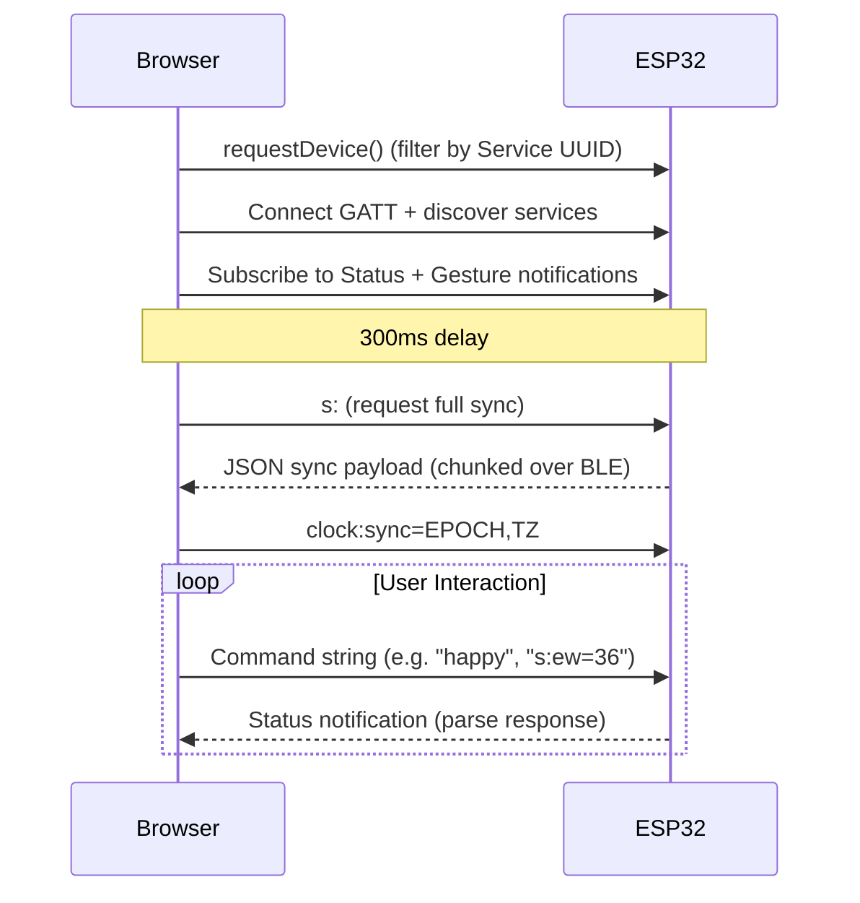

# Leor Web UI — Design Document

> **Version 1.0** · March 2026  
> SvelteKit 5 · Tailwind CSS 4 · Web Bluetooth API

---

## 1. Overview

The **Leor Web UI** (`web/`) is a SvelteKit 5 single-page application that controls the Leor desktop companion robot over **Bluetooth Low Energy (BLE)**. It provides real-time expression control, eye customization, gesture management, clock sync, and wireless firmware updates — all from a modern, responsive browser interface.

### Design Philosophy

| Principle | Implementation |
|:---|:---|
| **Bento Grid** | Card-based layout with chunky borders, hard shadows, and pastel colors |
| **Playful & Tactile** | Heavy drop-shadows that shift on press, emoji-driven expression buttons |
| **Mobile-First** | Responsive grid from 1→2→4 columns, touch-friendly controls |
| **Dark Mode** | Full light/dark theming via CSS custom properties, system preference detection |
| **Zero Backend** | All communication is peer-to-peer BLE — no server or cloud dependency |

---

## 2. Tech Stack

| Layer | Technology | Notes |
|:---|:---|:---|
| **Framework** | SvelteKit 5 | Runes-based reactivity (`$state`, `$effect`) |
| **Styling** | Tailwind CSS 4 | `@theme` tokens, `@utility` directives |
| **Build** | Vite 7 | Static adapter for GitHub Pages / local hosting |
| **Icons** | Lucide Svelte | `lucide-svelte` icon library |
| **Animations** | Svelte Motion | Spring/tween-based transitions |
| **BLE** | Web Bluetooth API | Direct browser ↔ ESP32 communication |
| **ML** | TensorFlow.js | Client-side gesture model support |
| **Utilities** | CVA, clsx, tailwind-merge | Class variance & conditional styling |

---

## 3. Architecture

```
leora/
├── src/
│   ├── app.css                  # Design system tokens & animations
│   ├── app.html                 # Root HTML shell
│   ├── lib/
│   │   ├── ble-config.ts        # BLE UUIDs & constants
│   │   ├── ble.svelte.ts        # Reactive BLE state & commands (616 LOC)
│   │   ├── utils.ts             # cn() helper (clsx + tailwind-merge)
│   │   └── components/          # 24 Svelte components
│   └── routes/
│       ├── +page.svelte         # Main dashboard (tab router)
│       ├── +layout.svelte       # Root layout
│       └── settings/+page.svelte # Legacy settings page
└── static/                      # Static assets
```

### Component Tree

```mermaid
graph TD
    Page["+page.svelte<br/>Main Dashboard"] --> Header["Header<br/>(BLE status, dark mode, connect)"]
    Page --> Tabs["AnimatedTabs<br/>(Home | Settings | Gestures | Update)"]

    subgraph "Home Tab"
        H1["ExpressionGrid<br/>15+ mood buttons"]
        H2["ActionButtons<br/>Blink, Wink, Laugh, Cry"]
        H3["LookPad<br/>8-direction gaze pad"]
        H4["MouthControls<br/>Shape & animation triggers"]
    end

    subgraph "Settings Tab"
        S1["ShufflePanel<br/>Auto-shuffle timing"]
        S2["GestureSettings<br/>Confidence, cooldown, reaction"]
        S3["AppearanceSettings<br/>Eye geometry, mouth, presets"]
        S4["DisplaySettings<br/>OLED type, I2C address"]
        S5["BreathingControl<br/>Intensity & speed"]
        S6["PowerSettings<br/>Deep sleep, GPIO config"]
        S7["ClockSettings<br/>Time sync, 12/24h format"]
    end

    subgraph "Gestures Tab"
        G1["GestureManager<br/>5-gesture mapping editor"]
    end

    subgraph "Update Tab"
        U1["OtaPanel<br/>BLE OTA firmware upload"]
    end

    Page --> H1 & H2 & H3 & H4
    Page --> S1 & S2 & S3 & S4 & S5 & S6 & S7
    Page --> G1
    Page --> U1

    style Page fill:#ffc9b5,stroke:#2D2424,stroke-width:2px
    style Header fill:#a3d9ff,stroke:#2D2424,stroke-width:2px
    style Tabs fill:#fae188,stroke:#2D2424,stroke-width:2px
```



---

## 4. Design System

### 4.1 Color Palette

```
Light Mode                          Dark Mode
─────────────────────────           ─────────────────────────
Paper (bg)    #FDFBF7               Paper (bg)    #201C1A
Ink (text)    #2D2424               Ink (text)    #F2EEDC
─────────────────────────           ─────────────────────────
Bento Pink    #FBC6D0               Bento Pink    #6E1C3B
Bento Blue    #A3D9FF               Bento Blue    #163A5F
Bento Green   #B9E6A0               Bento Green   #1B4830
Bento Yellow  #FAE188               Bento Yellow  #4A3B10
Bento Peach   #FFC9B5               Bento Peach   #6B2D18
Border        #2D2424               Border        #111111
```

### 4.2 Bento Card System

Two core utilities defined in `app.css`:

```css
/* Card container */
@utility bento-card {
    rounded-3xl border-4 border-bento-border
    shadow-[4px_4px_0px_0px_var(--color-bento-border)]
    overflow-hidden transition-all duration-300
}

/* Pressable button */
@utility bento-button {
    rounded-2xl border-4 border-bento-border
    shadow-[4px_4px_0px_0px_var(--color-bento-border)]
    active:shadow-none active:translate-y-[4px] active:translate-x-[4px]
    transition-all duration-150 font-bold
}
```

Each card is assigned a semantic color based on function:

| Color | Used For |
|:---|:---|
| **Pink** | Expressions, Mouth & Animations |
| **Blue** | Eye Appearance, Mouth Control, BLE connection |
| **Green** | Gaze Control, Gesture Recognition, Animation Speeds |
| **Yellow** | Quick Actions, Quick Presets, active/highlight states |
| **Peach** | Avatar, Reset buttons, accents |

### 4.3 Animations

| Animation | Purpose | Duration |
|:---|:---|:---|
| `blob` | Background ambient motion | 10s infinite |
| `appear` | Fade-in on load | 1s ease-out |
| `moveUp` | Slide-up entrance | 0.8s ease-out |
| `shine` | Shimmer button effect | Variable (CSS `--duration`) |
| `spin-around` | Magic border animation | Variable (CSS `--speed`) |
| Svelte `fly` | Tab content transitions | 300ms, y: 20px |

---

## 5. BLE Communication Layer

### 5.1 Service & Characteristics

```
Main Service:    4fafc201-1fb5-459e-8fcc-c5c9c331914b
├── Command:     beb5483e-36e1-4688-b7f5-ea07361b26a8  (write)
├── Status:      1c95d5e3-d8f7-413a-bf3d-7a2e5d7be87e  (notify)
└── Gesture:     d1e5f0a1-2b3c-4d5e-6f7a-8b9c0d1e2f3a  (notify)

OTA Service:     d6f1d96d-594c-4c53-b1c6-244a1dfde6d8
├── Control:     7ad671aa-21c0-46a4-b722-270e3ae3d830  (write + notify)
└── Data:        23408888-1f40-4cd8-9b89-ca8d45f8a5b0  (write)
```

### 5.2 State Management

All BLE state lives in a single Svelte 5 `$state` proxy (`bleState`) in `ble.svelte.ts`:

```
bleState
├── connected: boolean
├── lastStatus / lastGesture
├── settings: { ew, eh, es, er, mw, lt, vt, bi, gs, os, ss, td, wp, pp }
├── display: { type, addr }
├── shuffle: { enabled, exprMin/Max, neutralMin/Max }
├── breathing: { enabled, intensity, speed }
├── gesture: { matching, reactionTime, confidence, cooldown, mappings[] }
├── clock: { enabled, seconds, timezoneOffset, 24hour }
└── ble: { lowPowerMode, deviceName }
```

### 5.3 Sync Flow



The sync payload is a JSON object with sections: `settings`, `display`, `state`, `shuffle`, `breathing`, `ble`, `gesture`, `clock`. It may arrive chunked across multiple BLE notifications and is reassembled client-side.

---

## 6. Page & Tab Structure

### 6.1 Home Tab

The primary control surface using a responsive bento grid:

```
┌──────────────────────────────┬──────────────┬──────────────┐
│  EXPRESSIONS (pink)          │ QUICK ACTIONS│ GAZE CONTROL │
│  15+ mood button grid        │ (yellow)     │ (green)      │
│  2 columns span              │ Blink, Wink  │ 8-direction  │
│                              │ Laugh, Cry   │ drag pad     │
│                              │              │ (row-span 2) │
├──────────────────────────────┴──────────────┤              │
│  MOUTH CONTROL (blue)                       │              │
│  Shape buttons + animation triggers         │              │
│  3 columns span                             │              │
└─────────────────────────────────────────────┴──────────────┘
```

### 6.2 Settings Tab

Vertical stack of specialized bento cards:
- **ShufflePanel** + **GestureSettings** (2-column grid)
- **AppearanceSettings** — Eye Presets, Eye Geometry sliders (W/H/Spacing/Roundness), Mouth & Animations, Animation Speeds
- **DisplaySettings** — OLED type selector (SH1106/SSD1306), I2C address
- **BreathingControl** — Enable toggle, intensity/speed sliders
- **PowerSettings** — Deep sleep config, GPIO pin mapping, touch hold delay, BLE low power mode
- **ClockSettings** — Enable/disable, browser time sync, 12/24h toggle

### 6.3 Gestures Tab

**GestureManager** — Full gesture recognition dashboard:
- Toggle gesture matching on/off (live indicator)
- 5 gesture mappings (neutral, patpat, pickup, shake, swipe)
- Inline editing: tap expression badge → dropdown to remap
- Live detection highlight with emoji feedback
- Edge Impulse model: 5 classes @ 23Hz inference

### 6.4 Update Tab

**OtaPanel** — BLE Over-the-Air firmware update:
- File picker for `.bin` firmware
- Credit-based flow control (32-packet bursts)
- Progress bar with KB/packet counters
- Auto-boosts BLE TX power during transfer
- Disconnection watchdog with timeout recovery

---

## 7. Component Catalog

| Component | File | Lines | Purpose |
|:---|:---|:---|:---|
| `AppearanceSettings` | AppearanceSettings.svelte | 648 | Eye geometry, mouth, presets, timing |
| `PowerSettings` | PowerSettings.svelte | ~500 | Deep sleep, GPIO, BLE power |
| `GestureManager` | GestureManager.svelte | 297 | Gesture mapping editor |
| `GestureSettings` | GestureSettings.svelte | ~350 | Confidence, cooldown, reaction time |
| `BreathingControl` | BreathingControl.svelte | ~260 | Breathing animation controls |
| `ShufflePanel` | ShufflePanel.svelte | ~250 | Expression shuffle timing |
| `ClockSettings` | ClockSettings.svelte | ~240 | Clock mode, sync, format |
| `DisplaySettings` | DisplaySettings.svelte | ~240 | OLED display configuration |
| `OtaPanel` | OtaPanel.svelte | ~190 | BLE OTA firmware upload |
| `FlickeringGrid` | FlickeringGrid.svelte | ~150 | Animated background grid |
| `DualRangeSlider` | DualRangeSlider.svelte | ~130 | Min/max range input |
| `ConnectionButton` | ConnectionButton.svelte | ~120 | BLE connect/disconnect |
| `ShimmerButton` | ShimmerButton.svelte | ~110 | Animated shimmer button |
| `AnimatedTabs` | AnimatedTabs.svelte | ~60 | Bottom navigation tabs |
| `ShineBorder` | ShineBorder.svelte | ~55 | Animated border effect |
| `Dock` / `DockIcon` | Dock.svelte | ~50 | macOS-style dock (unused?) |
| `MasterBackground` | MasterBackground.svelte | ~15 | Background container |
| `ExpressionGrid` | ExpressionGrid.svelte | ~30 | Mood trigger grid |
| `MouthControls` | MouthControls.svelte | ~40 | Mouth shape buttons |
| `ActionButtons` | ActionButtons.svelte | ~20 | Quick action triggers |
| `LookPad` | LookPad.svelte | ~35 | Directional gaze pad |
| `InteractiveGrid` | InteractiveGrid.svelte | ~45 | Hover grid effect |
| `Lights` | Lights.svelte | ~40 | Ambient light blobs |

---

## 8. Visual Language & UI Patterns

### Cards

Every functional section is wrapped in a `bento-card` with:
- **4px solid border** in `--color-bento-border`
- **Hard drop shadow** (`4px 4px 0px 0px`) — no blur, pure offset
- **Rounded-3xl** corners (24px radius)
- **Semantic pastel background** color

### Controls

- **Range sliders**: Custom-styled with square thumbs, matching border/shadow system
- **Toggle switches**: Custom pill toggles with check/X icons, border-consistent
- **Buttons**: `bento-button` with press-down animation shifting shadow to zero
- **Value badges**: Monospace font in bordered chips (`bg-paper border-2 rounded-lg`)

### Responsive Breakpoints

| Breakpoint | Columns | Behavior |
|:---|:---|:---|
| Mobile (<768px) | 1 column | Stack everything, full-width cards |
| Tablet (768px+) | 2 columns | Side-by-side pairs |
| Desktop (1024px+) | 4 columns | Full bento grid with row spans |

### Navigation

Fixed bottom bar with `AnimatedTabs`:
- 4 tabs: **Home** · **Settings** · **Gestures** · **Update**
- Animated indicator sliding between tabs
- Content transitions via Svelte `fly` (y: 20px, 300ms)

---

## 9. Deployment

### Static Build (GitHub Pages)

```bash
cd leora
bun install
bun run build:pages    # vite build → static output
```

Output is configured for the `@sveltejs/adapter-static`, producing a fully static site that can be hosted on GitHub Pages, Netlify, or served locally.

### Local Development

```bash
cd leora
bun install
bun run dev           # → http://localhost:5173
```

> **Browser Requirement:** Web Bluetooth is only available in **Chrome**, **Edge**, and **Opera**. Firefox does not support it natively.

---

## 10. Future Considerations

- **PWA Support** — Service worker for offline access when BLE-connected
- **Preset Import/Export** — Share eye/expression configurations as JSON
- **Real-Time Eye Preview** — Canvas-based preview of eye geometry changes before applying
- **Multi-Device** — Connect to multiple Leor units simultaneously
- **Accessibility** — ARIA labels on all controls, keyboard navigation for gaze pad
- **i18n** — Internationalization for non-English users
