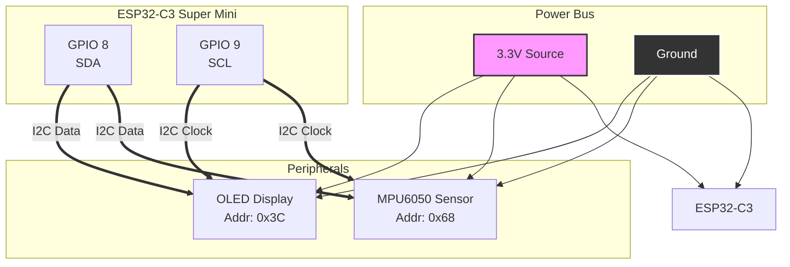
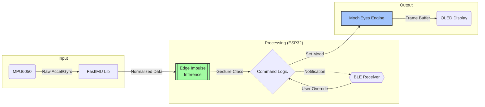

# Leor - Desk Companion Bot

<div align="center">
  
  <br/>
  
  [](LICENSE.md)
  [](https://www.arduino.cc/)
  [](https://kit.svelte.dev/)
  [](https://edgeimpulse.com/)

  <p><strong>A small, expressive, AI-powered friend for your desktop.</strong></p>

  
  <br/>
  <em>Leor reacting to gestures in real-time.</em>
</div>

---

## 📖 Overview

**Leor** is an open-source desktop companion that brings character to your workspace. Powered by an **ESP32-C3**, Leor uses an OLED display to render fluid, procedural eye animations and an IMU to understand physical interactions.

Whether you poke it, shake it, or pick it up, Leor reacts with distinct emotions powered by **Edge Impulse** machine learning. Control Leor's mood, sensitivity, and settings wirelessly via a modern SvelteKit web interface.

---

## ✨ Features

### 🤖 Core Personality
* **Expressive Eyes:** Procedural animations with blinking, saccades, and pupil dilation.
* **15+ Moods:** Happy, Sad, Angry, Confused, Sleepy, Suspicious, Love, and more.
* **Mouth Animations:** Lip-sync styles including Talk, Chew, and Wobble.
* **Smart Shuffle:** Automatically cycles through expressions for lifelike behavior.

### 🧠 AI & Sensors
* **Gesture Recognition:** Detects **Patting**, **Shaking**, **Swiping**, and **Pickups** using TinyML (Edge Impulse).
* **Auto-Calibration:** Gyroscope and accelerometer self-calibrate on every boot.

### 📱 Control & Connectivity
* **BLE Control:** Low-latency Bluetooth Low Energy connection.
* **Web Dashboard:** A beautiful SvelteKit app with gradient aesthetics and real-time feedback.
* **Persistent Memory:** Settings (sensitivity, brightness, eye geometry) are saved to Flash.
* **Serial & BLE API:** Full command reference is available in [`API.md`](API.md) (serial/BLE commands, gesture settings, shuffle, display controls).

---

## 🛠 Hardware Requirements

Leor is built with accessible, low-cost components.

| Component | Specification | Notes |
| :--- | :--- | :--- |
| **Microcontroller** | ESP32-C3 Super Mini | Compact form factor, built-in BLE 5.0 |
| **Display** | SH1106G / SSD1306 | 128x64 OLED (I2C), 0.96" or 1.3" |
| **IMU Sensor** | MPU6050 | 6-axis Gyroscope + Accelerometer |
| **Power** | USB-C or LiPo | ~100mA active draw |

> **Tip:** An external antenna is recommended for the ESP32-C3 if you plan to control Leor from across the room.

---

## 🔌 Wiring

All components connect via the I2C bus.



**Pin Mapping:**

| ESP32-C3 Pin | Function | Device Connection |
| --- | --- | --- |
| **3.3V** | Power | VCC |
| **GND** | Ground | GND |
| **GPIO 8** | I2C SDA | SDA |
| **GPIO 9** | I2C SCL | SCL |

---

## 🏗 Architecture & Data Flow

Leor uses a cyclic architecture where sensor data drives inference, inference drives logic, and logic drives animation.



---

## 🚀 Installation

### 1. Firmware (ESP32)

1. **Clone the Repo:**
```bash
git clone https://github.com/sanicxt/Leor.git
cd Leor
```


2. **Install Libraries:**
Use the Arduino Library Manager to install:
* `Adafruit GFX Library`
* `Adafruit SH110X`
* `FastIMU`
* `NimBLE-Arduino`


3. **Install Edge Impulse Model:**
* Download the Arduino library from the [Edge Impulse Project](https://studio.edgeimpulse.com/public/879322/live).
* In Arduino IDE: *Sketch > Include Library > Add .ZIP Library*.


4. **Upload:**
* Open `Leor.ino`.
* Select Board: **ESP32-C3 Dev Module**.
* **Important:** Keep Leor still for 2 seconds after plugging in for IMU calibration.


### 2. Web Interface (SvelteKit)

1. Navigate to the web app folder:
```bash
cd leora
```


2. Install dependencies and run:
```bash
bun install
bun run dev
```


3. Open `http://localhost:5173` in a BLE-supported browser (Chrome, Edge, Opera).

---

## 🎮 Interface & Gestures

### The Web Dashboard

The `leora` web interface is your command center.

* **Expression Grid:** One-tap access to 15+ animations.
* **Gesture Tuner:** Adjust "Confidence" and "Cooldown" sliders to fine-tune how easily Leor reacts to touches.
* **Eye Geometry:** Customize the size, spacing, and roundness of the eyes.

### Gesture Mapping

By default, Leor reacts to these physical interactions:

| Action | Detection | Reaction |
| --- | --- | --- |
| **Patting Head** | High freq, low amplitude vertical vibration | **Happy** |
| **Pickup** | Sudden vertical lift | **Curious** |
| **Shake** | Rapid horizontal oscillation | **Confused** |
| **Swipe** | Fast lateral movement | **Surprised** |

---

## ⚙️ Configuration

Hardware settings can be tweaked in `config.h` before flashing.

```cpp
// Bluetooth Name
const char* BLE_DEVICE_NAME = "Leor";

// Display Settings
#define I2C_ADDRESS 0x3c
#define SCREEN_WIDTH 128
#define FRAME_RATE 100

// Behavior
#define BLINK_INTERVAL 3   // Seconds between blinks
```

<details>
<summary><strong>📂 View Project Structure</strong></summary>

```
Leor/
├── Leor.ino                   # Main firmware sketch (Arduino .ino)
├── config.h                   # Hardware and behavior configuration
├── MochiEyes.h                # Animation engine
├── ble_manager.h              # NimBLE-based BLE manager
├── commands.h                 # Serial/BLE command parser
├── ei_gesture.h               # Edge Impulse inference integration
├── assets/                    # Images and demo GIFs (logo, demo)
├── API.md                     # CLI & BLE API reference
├── leora/                     # Web interface (SvelteKit)
└── edge_impulse_dataforwarder/ # Training utilities
    └── edge_impulse_dataforwarder.ino

```

</details>

---

## ❓ Troubleshooting

<details>
<summary><strong>IMU Initialization Failed</strong></summary>
Check your wiring. Ensure SDA goes to GPIO8 and SCL to GPIO9. Verify the MPU6050 address is 0x68 (default) or 0x69 in <code>config.h</code>.
</details>

<details>
<summary><strong>BLE Connection Issues</strong></summary>
Ensure you are using a browser that supports Web Bluetooth (Chrome/Edge). Firefox does not support this natively. Ensure the ESP32 antenna is not obstructed.
</details>

<details>
<summary><strong>False Positive Gestures</strong></summary>
Go to the Web Interface > Gesture Settings. Increase the <strong>Confidence Threshold</strong> (try 80%) or increase the <strong>Cooldown</strong> time.
</details>

---

## 📄 License

This project is open-source under the **GNU General Public License v3**.
See [LICENSE](LICENSE.md) for details.

### Credits

* *MochiEyes* core logic adapted from FluxGarage RoboEyes.
* *Edge Impulse* for the ML training platform.
* *FastIMU* for sensor abstraction.

---

<div align="center">
<sub>Built with ❤️ by <a href="https://www.google.com/search?q=https://github.com/sanicxt">Sanicxt</a></sub>
</div>

<div align="center">
<sub>Docs Made by GitHub Copilot</a></sub>
</div>