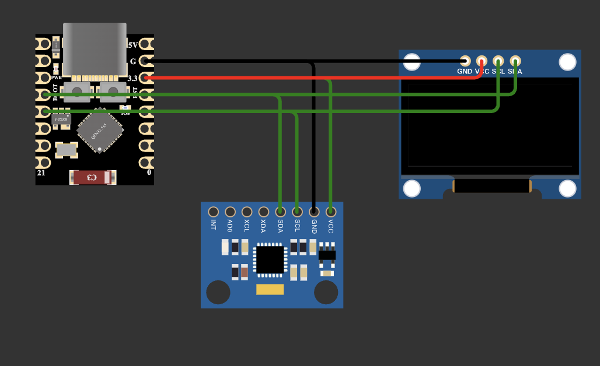

# Leor - Animated Robot Eyes

Leor is an animated robot eyes project built on ESP32-C3 with OLED display, IMU-based gesture recognition, and Bluetooth Low Energy (BLE) control. The project includes both firmware for the microcontroller and a web-based control interface.

---

## Table of Contents

- [Features](#features)
- [Hardware Requirements](#hardware-requirements)
- [Wiring Diagram](#wiring-diagram)
- [Software Architecture](#software-architecture)
- [Installation](#installation)
- [Web Interface](#web-interface)
- [BLE Commands](#ble-commands)
- [Gesture Recognition](#gesture-recognition)
- [Configuration](#configuration)
- [Project Structure](#project-structure)

---

## Features

- **Animated OLED Eyes**: Smooth, expressive robot eyes with multiple moods and positions
- **15+ Expressions**: Happy, sad, angry, confused, surprised, sleepy, curious, and more
- **Mouth Animations**: Talk, chew, wobble animations with smooth shape transitions
- **Gesture Recognition**: ML-based gesture detection using Edge Impulse (patpat, shake, swipe, pickup)
- **BLE Control**: Low-power Bluetooth control from web browser or mobile app
- **Expression Shuffle**: Random expression cycling for lifelike behavior
- **Expression Presets**: Quick preset styles (Cute, Sleepy, Energetic, Robotic)
- **Persistent Settings**: All settings saved to flash and restored on boot
- **Web Interface**: Modern SvelteKit-based control panel with gradient styling and real-time feedback
- **IMU Calibration**: Automatic gyroscope/accelerometer calibration at startup

---

## Hardware Requirements

| Component | Specification | Notes |
|-----------|---------------|-------|
| Microcontroller | ESP32-C3 Super Mini | Any ESP32-C3 board works |
| Display | SH1106G 128x64 OLED | I2C interface, 0.96" or 1.3" |
| IMU Sensor | MPU6050 (or compatible) | 6-axis gyro + accelerometer |
| Power | 3.3V or 5V USB | ~100mA typical draw |

### Optional Components

- External antenna for extended BLE range
- LiPo battery + charging circuit for portable operation

---

## Wiring Diagram

All components connect via I2C bus:



```
ESP32-C3 Super Mini
       |
       |-- 3.3V ----+---- VCC (OLED) ---- VCC (MPU6050)
       |            |
       |-- GND -----+---- GND (OLED) ---- GND (MPU6050)
       |
       |-- GPIO8 (SDA) --+-- SDA (OLED) ---- SDA (MPU6050)
       |                 |
       |-- GPIO9 (SCL) --+-- SCL (OLED) ---- SCL (MPU6050)
```

### I2C Addresses

| Device | Address |
|--------|---------|
| OLED Display | 0x3C |
| MPU6050 | 0x68 |

### Pin Configuration (ESP32-C3 Super Mini)

| Pin | Function |
|-----|----------|
| GPIO8 | I2C SDA |
| GPIO9 | I2C SCL |
| GPIO4 | (Reserved for future use) |

---

## Software Architecture

The project consists of two main parts:

### 1. Firmware (Arduino/ESP32)

```
pio.ino                 Main sketch - setup, loop, sensor handling
config.h                Hardware and timing configuration
MochiEyes.h             Eye animation library (expressions, blinking)
ble_manager.h           BLE server, characteristics, notifications
commands.h              Command parser and handler (30+ commands)
ei_gesture.h            Edge Impulse gesture recognition integration
```

### 2. Web Interface (SvelteKit)

```
leora/
  src/
    routes/             Pages (home, settings)
    lib/
      components/       UI components (GestureManager, ShufflePanel, etc.)
      ble.svelte.ts     BLE connection and state management
```

### Data Flow

```
[IMU Sensor] --> [FastIMU Library] --> [Edge Impulse Inference]
                                              |
                                              v
[OLED Display] <-- [MochiEyes] <-- [Expression Command] <-- [Gesture Match]
      ^                                                           |
      |                                                           v
      +------------------ [BLE Notification] -----------------> [Web UI]
```

---

## Installation

### 1. Clone the repository

```bash
git clone https://github.com/sanicxt/Leor.git
cd Leor
```

### 2. Firmware (ESP32)

1. Install Arduino IDE or Arduino CLI

2. Install required libraries via Library Manager:
   - Adafruit GFX Library (by Adafruit)
   - Adafruit SH110X (by Adafruit)
   - FastIMU (by LiquidCGS)

3. Download and Install the Edge Impulse library:
   - Visit the [Edge Impulse Public Project](https://studio.edgeimpulse.com/public/879322/live).
   - Clone the repository
   - Go to **Deployment**.
   - Search for **Arduino library** and click **Build**.
   - In Arduino IDE: Sketch > Include Library > Add .ZIP Library and select the downloaded file.

4. Open `pio.ino` in Arduino IDE

5. Select board: **ESP32-C3 Dev Module**

6. Upload to device

7. Keep device still during IMU calibration (first 2 seconds after boot)

### 3. Web Interface

1. Navigate to the `leora` directory

2. Install dependencies:

   ```bash
   bun install
   ```

3. Start development server:

   ```bash
   bun run dev
   ```

4. Open <http://localhost:5173> in Chrome or Edge (Web Bluetooth required)

---

## Web Interface

The web interface provides:

- **Premium Header**: Custom Leor robot logo with gradient styling
- **Expression Grid**: Tap to trigger any of 15+ expressions
- **Quick Actions**: Keyboard shortcuts panel with pink/rose gradient
- **Mouth Controls**: Shape selection and talk/chew/wobble animations
- **Gaze Control**: Arrow-based directional pad for eye movement
- **Gesture Manager**: View gesture-to-expression mappings with live detection
- **Gesture Tuning**: Presets (Sensitive/Balanced/Strict) + fine controls
- **Shuffle Panel**: Toggle + timing controls with Quick/Slow presets
- **Appearance Settings**: Quick presets (Cute/Sleepy/Energetic/Robotic), eye geometry, mouth & animation controls, reset to defaults button

---

## BLE Commands

Commands can be sent via BLE or Serial. Format: `command` or `command=value`

### Expression Commands

| Command | Description |
|---------|-------------|
| `happy` | Show happy expression |
| `sad` | Show sad expression |
| `angry` | Show angry expression |
| `confused` | Show confused expression |
| `surprised` | Show surprised expression |
| `sleepy` | Show sleepy expression |
| `curious` | Show curious expression |
| `love` | Show love (heart eyes) |
| `default` | Reset to neutral |

### Gesture Commands

| Command | Description |
|---------|-------------|
| `gm=1` / `gm=0` | Enable/disable gesture matching |
| `gs:` | Get gesture settings |
| `ga=INDEX:ACTION` | Set gesture action mapping |
| `grt=MS` | Set reaction time (500-10000ms) |
| `gcf=PERCENT` | Set confidence threshold (30-99%) |
| `gcd=MS` | Set cooldown (500-10000ms) |

### Shuffle Commands

| Command | Description |
|---------|-------------|
| `sh:` | Get shuffle settings |
| `sh:on` / `sh:off` | Enable/disable shuffle |
| `sh:expr=MIN-MAX` | Set expression duration range (seconds) |
| `sh:neutral=MIN-MAX` | Set neutral duration range (seconds) |

### Appearance Commands

| Command | Description |
|---------|-------------|
| `s:` | Get all appearance settings |
| `ew=N` | Eye width (pixels) |
| `eh=N` | Eye height (pixels) |
| `es=N` | Eye spacing (pixels) |
| `er=N` | Eye roundness (pixels) |
| `bi=N` | Blink interval (seconds) |
| `reset` | Reset all settings to defaults |

### Mouth Animation Commands

| Command | Description |
|---------|-------------|
| `talk N` | Trigger talk animation for N ms |
| `chew N` | Trigger chew animation for N ms |
| `wobble N` | Trigger wobble animation for N ms |
| `smile` | Set mouth to smile |
| `frown` | Set mouth to frown |
| `open` | Set mouth to open |
| `ooo` | Set mouth to O shape |
| `flat` | Set mouth to flat |

---

## Gesture Recognition

The project uses Edge Impulse for ML-based gesture recognition.

### Supported Gestures

| Gesture | Motion | Default Expression |
|---------|--------|-------------------|
| neutral | Device at rest | (none) |
| patpat | Gentle tapping | happy |
| pickup | Lift device up | curious |
| shake | Shake side-to-side | confused |
| swipe | Quick swipe motion | surprised |

### Model Specifications

- **Input**: 6-axis IMU (gyro + accelerometer)
- **Sample Rate**: 23 Hz
- **Window Size**: Configurable by Edge Impulse export
- **Inference Time**: ~9ms on ESP32-C3

### Tuning Parameters

Adjustable via web interface or BLE commands:

| Parameter | Range | Default | Description |
|-----------|-------|---------|-------------|
| Confidence | 30-99% | 70% | Minimum probability to trigger |
| Cooldown | 500-10000ms | 2000ms | Time between detections |
| Reaction Time | 500-10000ms | 1500ms | How long to show expression |

---

## Configuration

Edit `config.h` to customize hardware settings:

```cpp
// BLE
const char* BLE_DEVICE_NAME = "Leor";

// Display
#define I2C_ADDRESS 0x3c
#define SCREEN_WIDTH 128
#define SCREEN_HEIGHT 64
#define FRAME_RATE 100

// IMU
#define MPU_SAMPLE_RATE_MS 20

// Autoblinker
#define BLINK_INTERVAL 3
#define BLINK_VARIATION 3
```

---

## Project Structure

```
pio/
  pio.ino                   Main firmware sketch
  config.h                  Hardware configuration
  MochiEyes.h               Eye animation library
  ble_manager.h             BLE server implementation
  commands.h                Command parser (30+ commands)
  ei_gesture.h              Edge Impulse gesture integration
  
  leora/                    Web interface (SvelteKit)
    src/
      routes/
        +page.svelte        Home page with expressions
        settings/
          +page.svelte      Settings panel
      lib/
        ble.svelte.ts       BLE state management
        components/
          GestureManager.svelte
          GestureSettings.svelte
          ShufflePanel.svelte
          AppearanceSettings.svelte
          ExpressionGrid.svelte

  edge_impulse_dataforwarder/
    edge_impulse_dataforwarder.ino    Data collection for training
```

---

## Data Collection for Training

To train custom gestures:

1. Flash `edge_impulse_dataforwarder.ino` to your device

2. Run Edge Impulse data forwarder:

   ```bash
   edge-impulse-data-forwarder --baud-rate 115200
   ```

3. Collect samples in Edge Impulse Studio

4. Train model and export as Arduino library

5. Replace `leor_inferencing` library and recompile firmware

---

## Troubleshooting

### IMU Not Detected

- Check I2C wiring (SDA, SCL)
- Verify MPU6050 address is 0x68 (check AD0 pin)
- Try running I2C scanner sketch

### BLE Connection Fails

- Ensure using Chrome or Edge (Firefox lacks Web Bluetooth)
- Check device is advertising (LED indicator)
- Try power cycling the ESP32

### Gestures Not Detected

- Keep device still during calibration
- Check confidence threshold (lower if too strict)
- Verify gesture data format matches training data

---

## License

This project is licensed under the **GNU General Public License v3**. See [LICENSE.md](file:///Users/sanic/pio/LICENSE.md) for details.

---

## Credits

- MochiEyes animation library based on FluxGarage RoboEyes
- Edge Impulse for gesture ML platform
- FastIMU library for sensor abstraction
