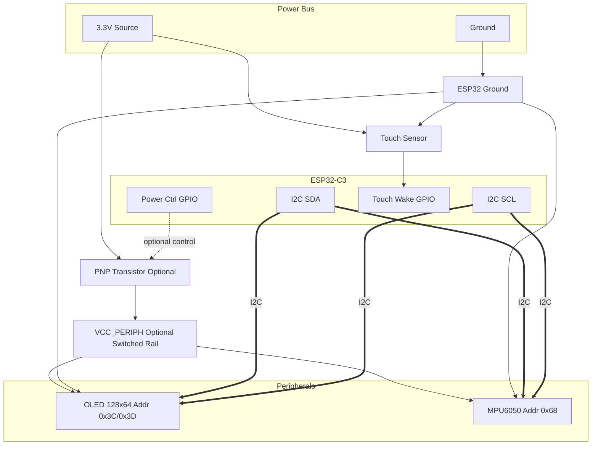

# Leor — Desk Companion Bot (ESP-IDF)

<div align="center">
  
  <br/>

  [](LICENSE.md)
  [](https://www.espressif.com/)
  [](https://docs.espressif.com/projects/esp-idf/)
  [](https://kit.svelte.dev/)

  <p><strong>A small, expressive desktop companion with BLE control and OTA updates.</strong></p>

  
  <br/>
  <em>Leor reacting to gestures in real time.</em>
</div>

---

## Overview

Leor is now a fully native ESP-IDF project at the repository root. The previous Arduino sketch layout has been replaced.

Key capabilities:

- Expressive procedural face rendering on 128x64 OLED
- Gesture-aware behavior driven by MPU6050 data
- BLE command/control + status notifications
- BLE OTA full-image update (`.bin`) with chunked credit-based transfer
- Web dashboard for live control, settings, and OTA
- Deep sleep + touch wake support

---

## Features

### Core Personality

- Procedural eye animations (blink, saccades, idle motion)
- Multiple expressions (happy, sad, angry, confused, sleepy, love, etc.)
- Mouth modes and timed mouth animations
- Shuffle mode for autonomous expression cycling

### Sensors + Behavior

- MPU6050 integration for motion-based behavior
- Configurable gesture matching settings from web/commands
- Persistent runtime configuration in NVS

### Connectivity

- BLE command API
- BLE status + gesture notifications
- Web Bluetooth dashboard (`web/`)
- OTA firmware update over BLE (full-image)

### Power

- Touch-hold deep sleep entry
- Wake via configured touch pin
- Peripheral power handling with optional external transistor control

---

## Hardware Requirements

| Component | Specification | Notes |
| --- | --- | --- |
| MCU | ESP32-C3 (primary) | ESP-IDF v6 target |
| Display | SH1106 / SSD1306 | 128x64 I2C OLED |
| IMU | MPU6050 | I2C motion sensor |
| Touch | Capacitive touch module | Wake/sleep trigger |
| Optional | PNP/transistor power gate | Peripheral rail control |

---

## Wiring (Reference)

All peripherals are on I2C. The touch input remains always powered for wake, while display/IMU may be switched depending on your board design.


```mermaid
graph TD
    subgraph Power Bus
      VCC[3.3V Source]
      GND[Ground]
    end

    ESPGND[ESP32 Ground]

    subgraph ESP32-C3
      SDA[I2C SDA]
      SCL[I2C SCL]
      WAKE[Touch Wake GPIO]
      PWR[Power Ctrl GPIO]
    end

    PNP[PNP Transistor Optional]
    VPERIPH[VCC_PERIPH Optional Switched Rail]
    TOUCH[Touch Sensor]

    subgraph Peripherals
      OLED[OLED 128x64 Addr 0x3C/0x3D]
      IMU[MPU6050 Addr 0x68]
    end

    VCC --> PNP
    PNP --> VPERIPH
    VPERIPH --> OLED & IMU
    VCC --> TOUCH
    GND --> ESPGND
    ESPGND --> OLED & IMU & TOUCH

    SDA == I2C ==> OLED & IMU
    SCL == I2C ==> OLED & IMU
    TOUCH --> WAKE
    PWR -. optional control .-> PNP
```

Use actual pin values from firmware/runtime config (`components/leor_core/include/leor/config.hpp` and persisted settings).

---

## Repository Layout

```
Leor/
├── CMakeLists.txt
├── sdkconfig
├── partitions.csv
├── main/
│   └── app_main.cpp
├── components/
│   └── leor_core/
│       ├── include/leor/
│       └── src/
├── API.md
├── DESIGN.md
└── web/
```

---

## Build + Flash (ESP-IDF v6)

From repo root:

```bash
idf.py build
```

Flash:

```bash
idf.py flash
```

Monitor:

```bash
idf.py monitor
```

Managed dependencies are fetched automatically by IDF Component Manager during `idf.py reconfigure/build`.

If `idf.py` is not found in your shell, source ESP-IDF once for your session:

```bash
. $HOME/.espressif/v6.0/esp-idf/export.sh
```

---

## OTA (Current)

- Firmware OTA mode: full-image `.bin`
- BLE data path: chunked streaming with credit flow-control
- Control path: REQUEST/ACK and DONE/ACK sequence
- Web panel: `web/src/lib/components/OtaPanel.svelte`

Use a valid ESP-IDF app image matching target/partition layout.

---

## Web Dashboard

```bash
cd web
bun install
bun run dev
```

Open `http://localhost:5173` in Chrome/Edge (Web Bluetooth required).

---

## Docs

- Command/API reference: `API.md`
- Architecture notes: `DESIGN.md`
- Web notes: `web/README.md`

---

## License

GPL v3. See `LICENSE.md`.
