# Leor - Desk Companion Bot

<div align="center">
  
  <br/>
  
  [](LICENSE.md)
  [](https://www.arduino.cc/)
  [](https://kit.svelte.dev/)
  [](https://edgeimpulse.com/)

  <p><strong>A small, expressive, AI-powered friend for your desktop.</strong></p>

  
  <br/>
  <em>Leor reacting to gestures in real-time.</em>
</div>

---

## 📖 Overview

**Leor** is an open-source desktop companion that brings character to your workspace. Powered by an **ESP32-C3** (with ESP32 and ESP32-C6 support), Leor uses an OLED display to render fluid, procedural eye animations and an IMU to understand physical interactions.

Whether you poke it, shake it, or pick it up, Leor reacts with distinct emotions powered by **Edge Impulse** machine learning. Control Leor's mood, sensitivity, and settings wirelessly via a modern SvelteKit web interface, and update firmware over-the-air via BLE OTA.

---

## ✨ Features

### 🤖 Core Personality

* **Expressive Eyes:** Procedural animations with blinking, saccades, and pupil dilation.
* **15+ Moods:** Happy, Sad, Angry, Confused, Sleepy, Suspicious, Love, and more.
* **Mouth Animations:** Lip-sync styles including Talk, Chew, and Wobble.
* **Smart Shuffle:** Automatically cycles through expressions for lifelike behavior.
* **Breathing Effect:** Subtle idle animation with configurable intensity and speed.

### 🧠 AI & Sensors

* **Gesture Recognition:** Detects **Patting**, **Shaking**, **Swiping**, and **Pickups** using TinyML (Edge Impulse).
* **Auto-Calibration:** Gyroscope and accelerometer self-calibrate on every boot.
* **Raw Pipeline:** Inference uses identical data format as training — no preprocessing mismatch.

### 📱 Control & Connectivity

* **BLE Control:** Low-latency Bluetooth Low Energy connection.
* **BLE OTA Firmware Updates:** Flash new firmware wirelessly from the web dashboard.
* **Web Dashboard:** A beautiful SvelteKit app with real-time gesture tuning, eye customization, and OTA.
* **Persistent Memory:** All settings saved to NVS Flash — survive reboots and deep sleep.
* **Serial & BLE API:** Full command reference in [`API.md`](API.md).

### ⚡ Power Management

* **Deep Sleep:** Long-press the touch button to enter µA-level deep sleep.
* **Parasitic Power Prevention:** I2C lines driven LOW and held during sleep to prevent current leaking through peripheral ESD diodes.
* **Board-Specific GPIO:** Automatically uses RTC GPIO (ESP32) or digital GPIO (C3/C6) APIs via compile-time detection.
* **Graceful Degradation:** If the display is missing, BLE still activates for recovery.

---

## 🛠 Hardware Requirements

| Component | Specification | Notes |
| :--- | :--- | :--- |
| **Microcontroller** | ESP32-C3 Super Mini | Compact, BLE 5.0. Also supports ESP32, ESP32-C6 |
| **Display** | SH1106G / SSD1306 | 128×64 OLED (I2C), 0.96″ or 1.3″ |
| **IMU Sensor** | MPU6050 | 6-axis Gyroscope + Accelerometer |
| **Power Switch** | PNP transistor (optional) | Cuts peripheral power during deep sleep |
| **Power** | USB-C or LiPo | ~100mA active, µA in deep sleep |

> **Tip:** An external antenna is recommended for the ESP32-C3 if you plan to control Leor from across the room.

---

## 🔌 Wiring

All peripherals connect via the I2C bus. A PNP transistor on the power rail allows the MCU to cut peripheral power during deep sleep.


**Pin Mapping (ESP32-C3 defaults):**

| Pin | Function | Notes |
| --- | --- | --- |
| **GPIO 8** | I2C SDA | Shared bus for OLED + IMU |
| **GPIO 9** | I2C SCL | Shared bus for OLED + IMU |
| **GPIO 2** | Touch/button wake | Configurable via BLE |
| **GPIO 3** | PNP power control | LOW = peripherals ON |

> Pins are configurable at runtime via BLE commands and stored in NVS.

---

## 🏗 Architecture

The firmware is split into focused, single-responsibility modules:

```
Leor/
├── Leor.ino                 # Main sketch — setup() + loop() skeleton
├── config.h                 # Hardware pins, BLE name, timing constants
├── display_manager.h        # OLED init, MochiEyes instances, screen helpers
├── power_manager.h          # Deep sleep, touch wake, board-specific GPIO
├── imu_manager.h            # IMU read, calibration, gesture pipeline
├── shuffle_manager.h        # Auto-expression shuffle logic
├── ble_manager.h            # NimBLE BLE stack and characteristics
├── ota_manager.h            # BLE OTA firmware update service
├── commands.h               # Serial/BLE command parser
├── ei_gesture.h             # Edge Impulse inference integration
├── MochiEyes.h              # Procedural eye animation engine
├── API.md                   # CLI & BLE API reference
├── leora/                   # Web interface (SvelteKit)
└── edge_impulse_dataforwarder/
    └── edge_impulse_dataforwarder.ino  # Data collection for EI training
```

### Data Flow

```mermaid
flowchart LR
    subgraph Input
        IMU(MPU6050) -->|Raw °/s + g| FastIMU[FastIMU Lib]
    end

    subgraph "Processing (ESP32)"
        FastIMU -->|Raw data| EI[[Edge Impulse<br>Inference]]
        EI -->|Gesture Class| Logic{Command Logic}
        BLE{{BLE Receiver}} -->|User Override| Logic
    end

    subgraph Output
        Logic -->|Set Mood| Mochi[MochiEyes Engine]
        Mochi -->|Frame Buffer| OLED(OLED Display)
        Logic -.->|Notification| BLE
    end

    style EI fill:#a2fca2,stroke:#333,stroke-width:2px
    style Mochi fill:#a2c4fc,stroke:#333,stroke-width:2px

```



### Board Compatibility

Board-specific code is isolated in `power_manager.h` using compile-time detection:

| Feature | ESP32 / S2 / S3 | ESP32-C3 / C6 |
| --- | --- | --- |
| GPIO hold during sleep | `rtc_gpio_hold_en()` | `gpio_hold_en()` + VDDSDIO domain |
| Wake source | `esp_sleep_enable_ext1_wakeup_io()` | `esp_deep_sleep_enable_gpio_wakeup()` |
| I2C pin management | RTC GPIO API | Standard GPIO API |

---

## 🚀 Installation

### 1. Firmware (ESP32)

1. **Clone the Repo:**

```bash
git clone https://github.com/sanicxt/Leor.git
cd Leor
```

1. **Install Libraries** (Arduino Library Manager):
   * `Adafruit GFX Library`
   * `Adafruit SH110X`
   * `Adafruit SSD1306`
   * `FastIMU`
   * `NimBLE-Arduino` (v2.1.x+)
   * `ArduinoJson`

2. **Install Edge Impulse Model:**
   * Download the Arduino library from the [Edge Impulse Project](https://studio.edgeimpulse.com/public/879322/live).
   * In Arduino IDE: *Sketch > Include Library > Add .ZIP Library*.

3. **Upload:**
   * Open `Leor.ino`.
   * Select Board: **ESP32-C3 Dev Module** (or ESP32 Dev Module).
   * **Important:** Keep Leor still for 2 seconds after boot for IMU calibration.

### 2. Web Interface (SvelteKit)

```bash
cd leora
bun install
bun run dev
```

Open `http://localhost:5173` in a BLE-supported browser (Chrome, Edge, Opera).

---

## 🎮 Gestures & Expressions

### Gesture Mapping

| Action | Detection | Reaction |
| --- | --- | --- |
| **Patting Head** | High freq, low amplitude vertical vibration | **Happy** |
| **Pickup** | Sudden vertical lift | **Curious** |
| **Shake** | Rapid horizontal oscillation | **Confused** |
| **Swipe** | Fast lateral movement | **Surprised** |

### Training Your Own Gestures

1. Flash `edge_impulse_dataforwarder/edge_impulse_dataforwarder.ino` to your board.
2. Run: `edge-impulse-data-forwarder --baud-rate 115200`
3. Collect samples in Edge Impulse Studio.
4. Train, export as Arduino library, and replace the `leor_inferencing` library.

> **Important:** The inference pipeline uses **raw sensor data** (gyro °/s + accel g) — identical to the data forwarder format. No preprocessing is applied.

---

## ⚙️ Configuration

Hardware settings in `config.h`:

```cpp
const char* BLE_DEVICE_NAME = "Leor";

#define I2C_ADDRESS   0x3c
#define SCREEN_WIDTH  128
#define FRAME_RATE    100

#define TOUCH_WAKE_PIN   2
#define PWR_CTRL_PIN     3
#define BLINK_INTERVAL   3   // Seconds between blinks
```

---

## ❓ Troubleshooting

<details>
<summary><strong>Display Not Found / No Display Connected</strong></summary>
Leor will continue booting without a display — BLE still activates. Use the BLE web interface to send <code>display:addr:0x3C</code> or <code>display:type:sh1106</code> to reconfigure, then <code>restart</code>.
</details>

<details>
<summary><strong>IMU Initialization Failed</strong></summary>
Check wiring. Ensure SDA → GPIO8 and SCL → GPIO9. Verify the MPU6050 address is 0x68 (default) in <code>config.h</code>.
</details>

<details>
<summary><strong>BLE Connection Issues</strong></summary>
Use a browser that supports Web Bluetooth (Chrome/Edge). Firefox does not support this natively. Ensure the ESP32 antenna is not obstructed.
</details>

<details>
<summary><strong>False Positive Gestures</strong></summary>
Go to Web Interface > Gesture Settings. Increase <strong>Confidence Threshold</strong> (try 80%) or increase <strong>Cooldown</strong> time.
</details>

<details>
<summary><strong>Peripherals Stay Powered in Deep Sleep</strong></summary>
This is caused by parasitic current through I2C pull-ups. The firmware drives SDA/SCL LOW and holds them during sleep. If using a custom board, ensure the PNP transistor power-cut pin is set correctly via <code>config.h</code> or BLE.
</details>

---

## 📄 License

This project is open-source under the **GNU General Public License v3**.
See [LICENSE](LICENSE.md) for details.

### Credits

* *MochiEyes* core logic adapted from FluxGarage RoboEyes.
* *Edge Impulse* for the ML training platform.
* *FastIMU* for sensor abstraction.

---

<div align="center">
<sub>Built with ❤️ by <a href="https://github.com/sanicxt">Sanicxt</a></sub>
</div>
